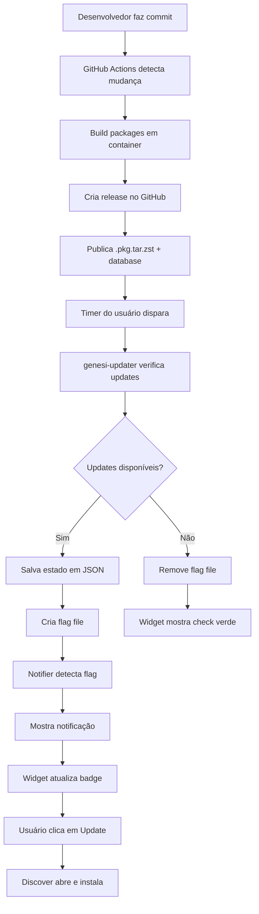

# Genesi OS - Sistema de Atualização Automática

## 🎯 Visão Geral

O Genesi OS possui um **sistema completo de atualização automática** que:

✅ **Detecta atualizações** automaticamente a cada hora  
✅ **Notifica o usuário** via desktop notification  
✅ **Mostra widget** na taskbar com contador de updates  
✅ **Integra com Discover** (GUI nativa do KDE)  
✅ **Publica updates** automaticamente via GitHub Actions  
✅ **Zero configuração** - funciona out of the box  

## 📦 Componentes

### 1. genesi-updater (Daemon)
**Arquivo**: `/usr/local/bin/genesi-updater`  
**Função**: Verifica updates disponíveis usando `checkupdates`

**Funcionalidades**:
- Roda a cada 1 hora (configurável)
- Não requer root (usa `checkupdates`)
- Salva estado em `/var/lib/genesi-updater/state.json`
- Cria flag file em `/tmp/genesi-updates-available`

### 2. genesi-updater.timer (Systemd Timer)
**Arquivo**: `/usr/lib/systemd/system/genesi-updater.timer`  
**Função**: Agenda verificações automáticas

**Configuração**:
- Primeira verificação: 5 minutos após boot
- Verificações seguintes: a cada 1 hora
- Randomização: ±10 minutos (evita sobrecarga no servidor)
- Persistente: executa verificações perdidas após boot

### 3. genesi-update-notifier (Notification Daemon)
**Arquivo**: `/usr/local/bin/genesi-update-notifier`  
**Função**: Monitora flag file e mostra notificações

**Funcionalidades**:
- Inicia automaticamente no login (autostart)
- Verifica flag file a cada 5 minutos
- Mostra notificação apenas quando contador muda
- Integra com sistema de notificações do KDE

### 4. Plasma Widget
**Localização**: `/usr/share/plasma/plasmoids/org.genesi.updater/`  
**Função**: Widget visual na taskbar

**Funcionalidades**:
- Ícone pulsante quando há updates
- Badge com número de updates
- Popup com lista de pacotes
- Botão "Update All" abre Discover
- Atualiza a cada 5 segundos

### 5. GitHub Actions Workflow
**Arquivo**: `.github/workflows/publish-packages.yml`  
**Função**: Build e publicação automática de pacotes

**Trigger**:
- Push em `genesi-arch/packages/**`
- Workflow manual (workflow_dispatch)

**Processo**:
1. Build de todos os pacotes em container Arch Linux
2. Criação de release tag com timestamp
3. Upload de `.pkg.tar.zst` + database para GitHub Releases
4. Atualização do release `packages-latest`

## 🔄 Fluxo Completo



## 🚀 Como Funciona para o Usuário

### Experiência do Usuário

1. **Sistema verifica updates automaticamente** (a cada hora)
2. **Notificação aparece** quando há updates:
   ```
   🔄 3 Updates Available
   Packages: genesi-ai-mode, genesi-settings, firefox
   Click to open Discover and update.
   ```
3. **Widget na taskbar** mostra ícone pulsante com badge "3"
4. **Usuário clica** no widget ou notificação
5. **Discover abre** na aba de updates
6. **Usuário clica "Update All"**
7. **Pacotes são instalados** automaticamente
8. **Widget volta ao normal** (check verde)

### Métodos de Atualização

#### Método 1: GUI (Recomendado)
```bash
# Usuário clica no widget ou notificação
# Discover abre automaticamente
# Clica em "Update All"
```

#### Método 2: Terminal
```bash
# Verificar updates
checkupdates

# Atualizar tudo
sudo pacman -Syu

# Atualizar apenas Genesi packages
sudo pacman -S genesi-settings genesi-kde-settings genesi-ai-mode genesi-updater
```

#### Método 3: Forçar verificação manual
```bash
# Rodar daemon manualmente
/usr/local/bin/genesi-updater

# Ver estado atual
cat /var/lib/genesi-updater/state.json
```

## ⚙️ Configuração

### Arquivo de Configuração
**Localização**: `/etc/genesi-updater.conf`

```ini
# Intervalo de verificação em segundos (padrão: 3600 = 1 hora)
check_interval=3600

# Download automático de updates (requer root)
auto_download=false

# Mostrar notificações desktop
notify_user=true

# Incluir pacotes AUR (requer yay/paru)
include_aur=false

# Urgência das notificações: low, normal, critical
notification_urgency=normal

# Auto-update apenas pacotes Genesi (seguro)
auto_update_genesi=false
```

### Habilitar/Desabilitar

```bash
# Habilitar (padrão)
sudo systemctl enable --now genesi-updater.timer

# Desabilitar
sudo systemctl disable --now genesi-updater.timer

# Status
sudo systemctl status genesi-updater.timer

# Ver próxima execução
systemctl list-timers genesi-updater.timer
```

### Logs

```bash
# Ver logs do daemon
sudo journalctl -u genesi-updater -f

# Ver log file
sudo tail -f /var/log/genesi-updater.log

# Ver estado atual
cat /var/lib/genesi-updater/state.json
```

## 🔧 Para Desenvolvedores

### Publicar Nova Versão de Pacote

1. **Editar PKGBUILD**:
```bash
cd genesi-arch/packages/genesi-ai-mode
nano PKGBUILD

# Incrementar pkgrel ou pkgver
pkgver=1.0.1  # ou
pkgrel=2
```

2. **Commit e push**:
```bash
git add .
git commit -m "feat: update genesi-ai-mode to 1.0.1"
git push origin arch-base
```

3. **GitHub Actions faz o resto**:
- Build automático
- Criação de release
- Publicação de pacotes

4. **Usuários recebem update**:
- Dentro de 1 hora (próxima verificação)
- Ou imediatamente se clicarem em "Check" no widget

### Testar Localmente

```bash
# Build packages
cd genesi-arch/packages
bash build-packages.sh

# Instalar localmente
sudo pacman -U repo/genesi-updater-*.pkg.tar.zst

# Testar daemon
sudo systemctl restart genesi-updater.service
sudo journalctl -u genesi-updater -f

# Testar widget
kquitapp5 plasmashell && kstart5 plasmashell
```

### Estrutura do State File

```json
{
  "last_check": "2026-05-01T14:30:00",
  "updates_available": 3,
  "packages": [
    {
      "name": "genesi-ai-mode",
      "old_version": "1.0.0-1",
      "new_version": "1.0.1-1"
    },
    {
      "name": "firefox",
      "old_version": "125.0-1",
      "new_version": "126.0-1"
    }
  ]
}
```

## 📊 Estatísticas e Monitoramento

### Ver Estatísticas de Updates

```bash
# Quantos updates foram instalados
pacman -Qe | wc -l

# Histórico de updates
grep "upgraded" /var/log/pacman.log | tail -20

# Último update
grep "upgraded" /var/log/pacman.log | tail -1
```

### Monitorar Uso do Sistema

```bash
# Ver se daemon está rodando
ps aux | grep genesi-updater

# Ver uso de recursos
systemctl status genesi-updater.service

# Ver timers ativos
systemctl list-timers
```

## 🐛 Troubleshooting

### Updates não aparecem

```bash
# Forçar refresh do database
sudo pacman -Syy

# Verificar se repo está acessível
curl -I https://github.com/zFreshy/GenesiOS/releases/download/packages-latest/genesi.db.tar.gz

# Verificar pacman.conf
cat /etc/pacman.conf | grep -A 2 "\[genesi\]"
```

### Notificações não aparecem

```bash
# Verificar se notifier está rodando
ps aux | grep genesi-update-notifier

# Reiniciar notifier
killall genesi-update-notifier
/usr/local/bin/genesi-update-notifier &

# Testar notificação manualmente
notify-send "Test" "This is a test notification"
```

### Widget não aparece

```bash
# Verificar se arquivos existem
ls -la /usr/share/plasma/plasmoids/org.genesi.updater/

# Reiniciar Plasma
kquitapp5 plasmashell && kstart5 plasmashell

# Adicionar widget manualmente
# Right-click taskbar → Add Widgets → Genesi Updater
```

### Daemon não inicia

```bash
# Ver erro
sudo journalctl -u genesi-updater -n 50

# Verificar permissões
ls -la /usr/local/bin/genesi-updater

# Testar manualmente
sudo /usr/local/bin/genesi-updater
```

## 🎨 Customização

### Mudar Intervalo de Verificação

```bash
# Editar timer
sudo systemctl edit genesi-updater.timer

# Adicionar:
[Timer]
OnUnitActiveSec=30min  # Verificar a cada 30 minutos

# Recarregar
sudo systemctl daemon-reload
sudo systemctl restart genesi-updater.timer
```

### Desabilitar Notificações

```bash
# Editar config
sudo nano /etc/genesi-updater.conf

# Mudar para:
notify_user=false

# Ou desabilitar notifier
sudo systemctl disable genesi-update-notifier
```

### Customizar Widget

```bash
# Editar QML
sudo nano /usr/share/plasma/plasmoids/org.genesi.updater/contents/ui/main.qml

# Reiniciar Plasma
kquitapp5 plasmashell && kstart5 plasmashell
```

## 📈 Benefícios

✅ **Automático**: Usuário não precisa lembrar de atualizar  
✅ **Transparente**: Mostra exatamente o que será atualizado  
✅ **Seguro**: Usa ferramentas nativas do Arch (pacman)  
✅ **Rápido**: GitHub CDN é mundial e rápido  
✅ **Gratuito**: GitHub Releases é grátis para repos públicos  
✅ **Integrado**: Funciona com Discover (GUI nativa)  
✅ **Confiável**: Systemd timers são robustos  
✅ **Leve**: Daemon usa <10MB RAM  

## 🚀 Próximos Passos

- [ ] Adicionar suporte a AUR packages
- [ ] Implementar auto-update de pacotes Genesi (seguro)
- [ ] Adicionar changelog no widget
- [ ] Implementar rollback de updates
- [ ] Adicionar estatísticas de uso
- [ ] Criar mirror servers para redundância
- [ ] Implementar assinatura GPG de pacotes

---

**Status**: ✅ IMPLEMENTADO E FUNCIONAL

**Versão**: 1.0.0

**Última atualização**: 2026-05-01
